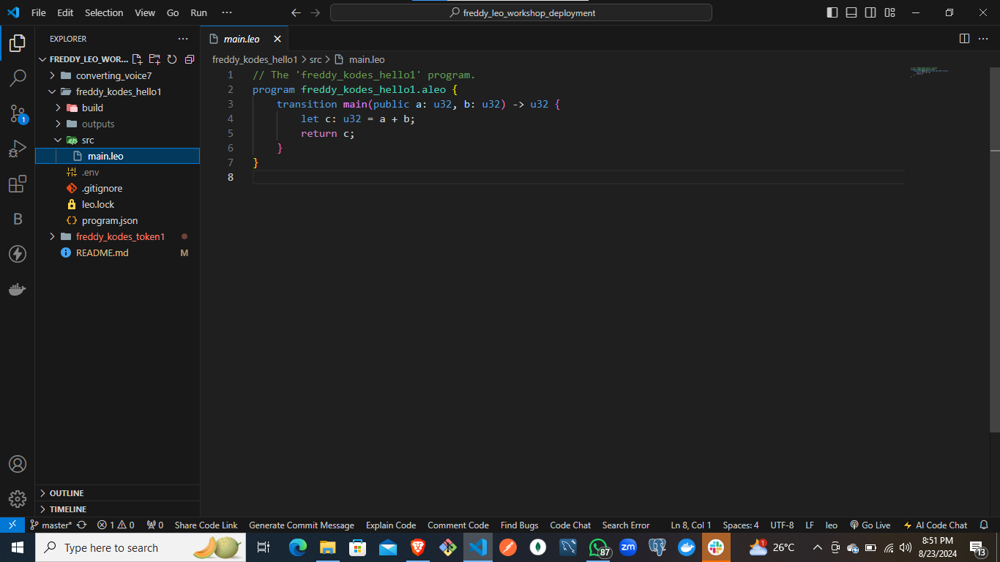
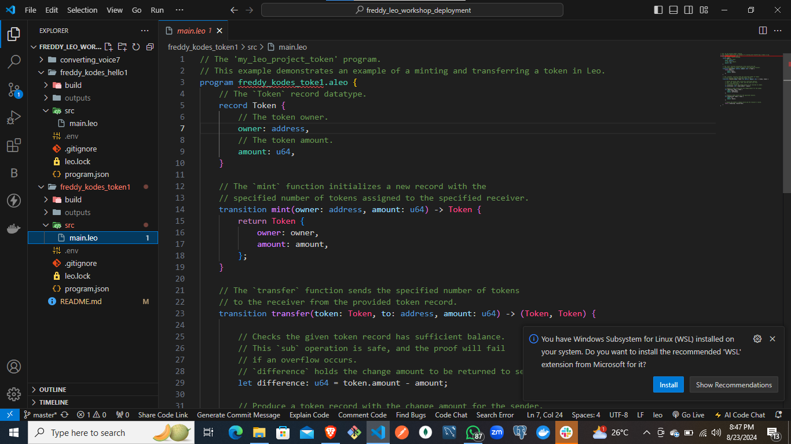
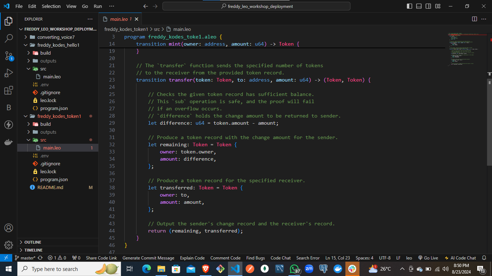
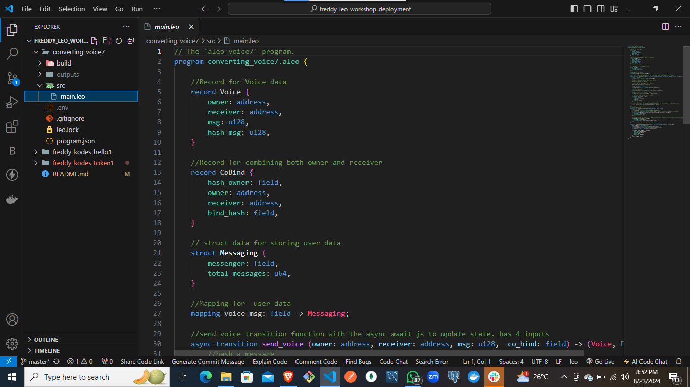
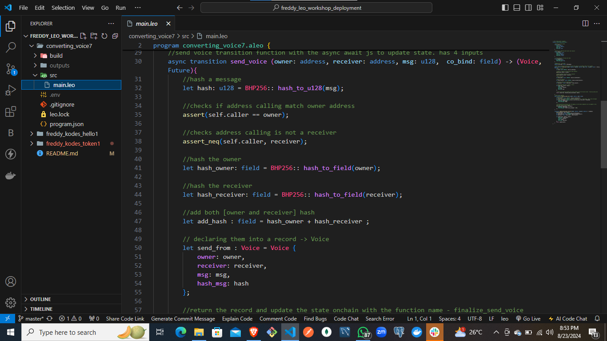
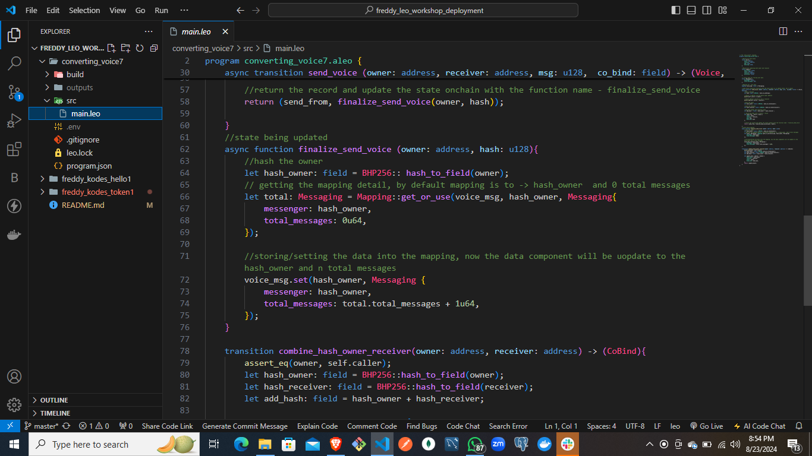
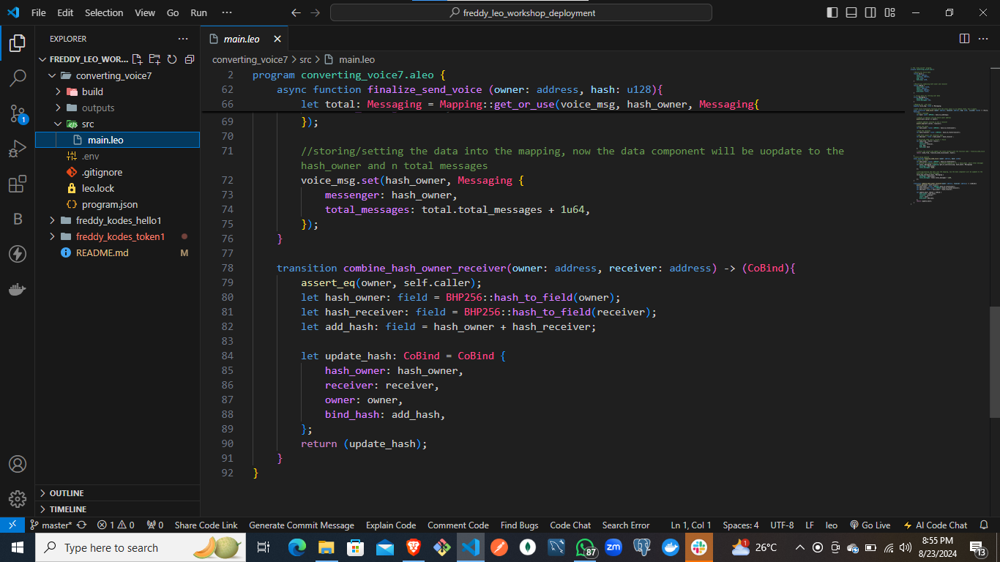

# ALEO BLOCKCHAIN WORKSHOP 1 
## Deployment Link: https://explorer.aleo.org/transaction/at1t0asqhpwl3kp60p05ze52pd2frjfal78vgmkq06qkea24pvcd5qq2qsfrn
### Deployment ID: at1t0asqhpwl3kp60p05ze52pd2frjfal78vgmkq06qkea24pvcd5qq2qsfrn
#### Description of Steps Used
For my freddy_kodes_hello1, I wrote the following code accordingly:
- leo new freddy_kodes_hello1: This was to create my project
- cd freddy_kodes_hello1: To change directory to current working directory
- Changed the private key in the .env file to the private key in my leo wallet
- leo run 2u32 3u32 --network testnet: This was to add the two numbers which gave us 5u32. u32 is the datatype
- leo deploy --network testnet: This made it possible for us to see the changes/activities on our leo wallet

##### Screenshot

# ALEO BLOCKCHAIN WORKSHOP 2
## Deployment Link: https://explorer.aleo.org/transaction/at15a7082jd2aml4qnr8686ult5a5vlxctlgppsng2ufjpuxnch85xqwzxmt0
### Deployment ID: at15a7082jd2aml4qnr8686ult5a5vlxctlgppsng2ufjpuxnch85xqwzxmt0
#### Description of Steps Used
For my freddy_kodes_token1, I Wrote the codes using the following
- ../ to go to the examples directory inside my project root directory
- leo new freddy_kodes_hello1: This was to create my project
- cd freddy_kodes_hello1: To change directory to current working directory
- Changed the private key in the .env file to the private key in my leo wallet
- leo run mint <my_aleo_address> <amount>u64; e.g leo run mint aleo1lf7nud7l3re920afgv9vtrx84uk3rdr3ryuzzufxx9matc73pyqsv6rq7g 100u64
- leo run transfer "<Token_Record>" <to_address> <amount>u64
- We were  able to use the generated record from 1st command to input into the second command's first input and then our to address and amount
- leo deploy --network testnet

##### Screenshot

# ALEO BLOCKCHAIN WORKSHOP 3
## Deployment Link: https://explorer.aleo.org/transaction/at184z49c6m59dqnqc7df603gqxadpvvvuxhve2ul93xk3rw06un5fqn2ue99
### Deployment ID: at184z49c6m59dqnqc7df603gqxadpvvvuxhve2ul93xk3rw06un5fqn2ue99
#### Description of Steps Used
For my converting_voice7, I Wrote the codes using the following
- ../ to go to the examples directory inside my project root directory
- leo new converting_voice7: This was to create my project
- cd converting_voice7: To change directory to current working directory
- Changed the private key in the .env file to the private key in my leo wallet
- leo run combine_hash_owner_receiver my leo wallet address receivers leo wallet address;
- example: leo run combine_hash_owner_receiver aleo1lf7nud7l3re920afgv9vtrx84uk3rdr3ryuzzufxx9matc73pyqsv6rq7g aleo14a5rw2f8amdlumlfexuka8q4cq83vrrw5pdz3m2mafzt3fy7hqrqjr3cu3
- leo deploy --network testnet

##### Screenshot

